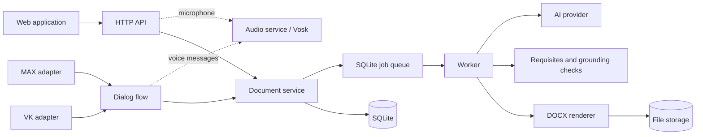

<div align="center">

[Русский](README.md) | 🇬🇧 English

# 📄 DocxGen

**AI-powered Russian business document generator**

Generate ГОСТ-compliant DOCX documents from text drafts with AI-powered correction, field extraction, and professional formatting.

[](https://opensource.org/licenses/MIT)
[](https://nodejs.org/)
[](https://pnpm.io/)
[](https://www.typescriptlang.org/)
[](https://react.dev/)
[](https://expressjs.com/)
[](#-quick-start)

</div>

---

## 🎯 Overview

DocxGen is an AI-powered Russian business document generator designed for organizations that need to produce ГОСТ-compliant documents quickly and accurately.

**How it works:**
1. User provides a text draft (via web UI, MAX bot, or VK bot)
2. AI corrects spelling, grammar, and style
3. System extracts required requisites (sender, recipient, date, etc.)
4. DOCX file is rendered in ГОСТ-compliant format
5. User downloads the finished document

**Key capabilities:**
- 🤖 AI-powered text correction and field extraction
- 📋 9 document types × 2 templates = 18 professional layouts
- 🎙️ Russian speech recognition (Vosk)
- 💬 Multi-channel: Web UI + MAX bot + VK bot
- ✅ ГОСТ Р 7.0.97-2016 compliance checks
- 📜 Version history with restore capability

---

## ✨ Features

| Feature | Description |
|---------|-------------|
| **AI Text Correction** | Automatic spelling, grammar, and style improvements |
| **Field Extraction** | AI extracts sender, recipient, date, subject from draft text |
| **ГОСТ Compliance** | Automated checks against Russian state standard Р 7.0.97-2016 |
| **Placeholder System** | Russian labels serve as field keys — intuitive for users |
| **Field Grounding** | AI must quote source text for extracted fields — auditable |
| **Version History** | Track all document versions with restore capability |
| **Batch Processing** | Process up to 20 documents simultaneously |
| **Speech Recognition** | Russian STT via Vosk — dictation to document |
| **Multi-Channel** | Web UI, MAX messenger bot, VKontakte bot |
| **File Caching** | Content-hash based deduplication |
| **Auto Cleanup** | Configurable retention for files and logs |

---

## 🚀 Quick Start

```bash
# 1. Install dependencies
pnpm install

# 2. Configure environment (interactive wizard)
pnpm setup:env

# 3. (Optional) Set up audio/speech recognition
pnpm setup:audio

# 4. Start development server
pnpm dev
```

**Access the application:**
- **Frontend:** http://localhost:5173 (Vite dev server)
- **Backend API:** http://localhost:3000

The Vite dev server automatically proxies `/api` requests to the backend.

---

## ⚙️ Setup Scripts

### `pnpm setup:env` — Environment Configuration

Interactive `.env` configuration wizard. Run from project root:

```bash
pnpm setup:env
```

This launches an interactive CLI that walks you through:

| Section | What It Configures |
|---------|-------------------|
| **Server** | Port, public URL, data directory, log level |
| **AI Provider** | OpenAI, OpenCode CLI, or mock mode |
| **AI Settings** | API keys, runtime, model selection |
| **Bots** | MAX and VK integrations (optional) |

**Features:**
- Creates `.env` file in project root
- Can be re-run to update existing configuration
- Validates inputs at each step
- Provides sensible defaults

### `pnpm setup:audio` — Speech Recognition Service

Sets up the Vosk-based audio/speech recognition service:

```bash
pnpm setup:audio
```

**This script:**
1. Checks for `ffmpeg` in PATH (required for audio processing)
2. Creates Python virtual environment at `packages/backend/.venv-audio`
3. Installs the `vosk` Python package
4. Downloads the Russian Vosk model (`vosk-model-small-ru-0.22`) if not present

**Prerequisites:**
- Python 3.x installed
- `ffmpeg` installed on system

**What it enables:**
- Voice message transcription in Russian
- Microphone dictation in the web UI
- Audio processing for bot channels

---

## 🏗️ Architecture



**Data flow:**
1. User submits text via Web UI, MAX, or VK
2. Document service creates a job in SQLite queue
3. Worker processes job: AI corrects text → extracts fields → validates
4. DOCX renderer generates ГОСТ-compliant document
5. File stored and served to user

---

## 📡 API Reference

### Authentication
Cookie-based identity — no login required. User identity is automatic.

### Endpoints

| Method | Endpoint | Description |
|--------|----------|-------------|
| `GET` | `/health` | Health check |
| `GET` | `/api/catalog` | Available document types and templates |
| `POST` | `/api/documents` | Create new document |
| `POST` | `/api/documents/:id/process` | Start AI processing (async) |
| `PATCH` | `/api/documents/:id` | Update document |
| `PUT` | `/api/documents/:id/fields` | Set field values |
| `POST` | `/api/documents/:id/render` | Render to DOCX |
| `GET` | `/api/files/:fileId` | Download DOCX file |
| `POST` | `/api/audio/transcribe` | Speech-to-text (Russian) |
| `GET` | `/api/documents/:id/versions` | Version history |
| `POST` | `/api/documents/:id/retry` | Retry after AI failure |

**Full API documentation:** [docs/api.md](docs/api.md)

---

## 📑 Document Types

| Type | Russian Name | Purpose |
|------|--------------|---------|
| **Memo** | Служебная записка | Internal memo between departments |
| **Report** | Докладная записка | Report memo to management |
| **Reference** | Информационная справка | Factual summary for audits/archives |
| **Letter** | Письмо | Official organizational letter |
| **Explanatory Note** | Пояснительная записка | Technical explanation or justification |
| **Order** | Приказ | Executive order or directive |
| **Protocol** | Протокол | Meeting minutes or resolution record |
| **Act** | Акт | Completion report or verification record |
| **Statement** | Заявление | Personal or organizational application |

### Templates

| Template | Russian Name | Style |
|----------|--------------|-------|
| **Classic** | Классический | Times New Roman 14pt, 1.5 line spacing, traditional corporate layout |
| **Modern** | Современный | Arial 12pt, 1.15 line spacing, contemporary regulatory layout |

---

## 🤖 AI Providers

| Provider | API Key | Description |
|----------|---------|-------------|
| `opencode` | Not required | OpenCode CLI with free models |
| `openai` | Required | OpenAI-compatible API (any provider) |
| `mock` | Not required | No AI, deterministic output (for testing) |

**Configuration:** Set `AI_PROVIDER` in `.env` file via `pnpm setup:env`.

---

## 📁 Project Structure

```
DocxGen/
├── packages/
│   ├── backend/          # Express 5 API + document service
│   │   ├── config/       # doc-types/*.json, templates/*.json
│   │   └── src/
│   │       ├── ai/       # AI pipeline (prompt, process, parse)
│   │       ├── audio/    # Vosk STT client
│   │       ├── core/     # documentService (lifecycle, render)
│   │       ├── docx/     # OOXML blocks, render, units
│   │       ├── jobs/     # Queue, worker
│   │       ├── http/     # REST API routes
│   │       ├── bot/      # Dialog flow state machine
│   │       └── adapters/ # MAX, VK platform adapters
│   └── frontend/         # React 19 + Vite + Tailwind
├── scripts/              # Setup wizards (setup-env.js, setup-audio.mjs)
├── prompts/              # AI system prompt (system.md)
├── docs/                 # Architecture, API, templates, fields reference
├── examples/             # Example documents
├── Containerfile         # Docker/Podman build
└── package.json          # Root workspace config
```

---

## 🛠️ Available Scripts

| Command | Description |
|---------|-------------|
| `pnpm install` | Install all dependencies |
| `pnpm setup:env` | Interactive environment configuration |
| `pnpm setup:audio` | Set up Vosk speech recognition |
| `pnpm dev` | Start full development stack |
| `pnpm start` | Start backend + audio (no frontend) |
| `pnpm build` | Build all packages |
| `pnpm test` | Run test suite (Vitest) |
| `pnpm typecheck` | Type-check all packages |

---

## 💬 Bot Setup

### MAX Bot (Russian Messenger)

- **Local development:** Polling mode
- **Production:** Webhook mode

### VK Bot (VKontakte)

- **Local development:** Long Poll mode
- **Production:** Callback API mode

**Detailed setup instructions:** [docs/bots-setup.md](docs/bots-setup.md)

---

## ⚠️ Limitations

| Limitation | Workaround |
|------------|------------|
| SQLite is local to `DATA_DIR` | Use persistent volume for deployment |
| Polling modes for local dev only | Production needs HTTPS + webhook/callback |
| Mock AI is deterministic | Use `opencode` or `openai` for real corrections |
| OpenCode runtime requires CLI | Install OpenCode CLI or use containerized build |
| Files cleaned up after retention period | Download files before cleanup |

---

## 📚 Documentation

| Document | Description |
|----------|-------------|
| [Architecture](docs/architecture.md) | System design and data flow |
| [REST API](docs/api.md) | Complete API reference |
| [Document Generation](docs/document-generation.md) | How documents are created |
| [Templates](docs/TEMPLATES.md) | Template system reference |
| [Fields Reference](docs/FIELDS-REFERENCE.md) | All document fields |
| [Placeholder Protocol](docs/PLACEHOLDER-PROTOCOL.md) | Placeholder system docs |
| [AI Processing](docs/ai.md) | AI pipeline details |
| [Audio Service](docs/audio-service.md) | Vosk STT integration |
| [Bot Setup](docs/bots-setup.md) | MAX and VK bot configuration |
| [Integration Guide](docs/integration-guide.md) | How to integrate with DocxGen |
| [Adding Types/Templates](docs/adding-type-or-template.md) | Extend document types |
| [Current Limitations](docs/limitations.md) | Known issues and constraints |

---

## 🤝 Contributing

Contributions are welcome! Please follow these steps:

1. **Fork** the repository
2. **Create** a feature branch (`git checkout -b feature/amazing-feature`)
3. **Commit** your changes (`git commit -m 'Add amazing feature'`)
4. **Push** to the branch (`git push origin feature/amazing-feature`)
5. **Open** a Pull Request

### Development Guidelines

- Use `pnpm` as package manager (never npm/npx)
- Follow existing code style
- Add tests for new features
- Update documentation as needed

---

## 📄 License

This project is licensed under the **MIT License** — see the [LICENSE](LICENSE) file for details.

---

## 🙏 Acknowledgments

- [docx](https://github.com/dolanmiu/docx) — OOXML document generation
- [Vosk](https://alphacephei.com/vosk/) — Russian speech recognition
- [vk-io](https://github.com/node-libs/vk-io) — VKontakte and MAX bot integration
- [Radix UI](https://www.radix-ui.com/) — Accessible React components
- [Framer Motion](https://www.framer.com/motion/) — Animation library

---

<div align="center">

**Built with ❤️ for Russian business document automation**

</div>
