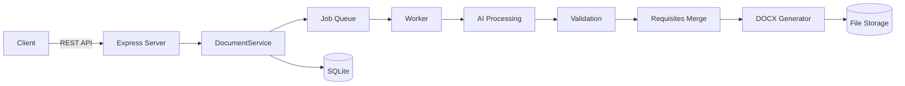

# DocxGen — Документ за 3 шага

AI-powered backend that turns Russian text drafts into formatted DOCX documents.

## What It Does

DocxGen takes a rough draft in Russian and transforms it into a properly formatted, editable DOCX file. The AI handles spelling, grammar, and style corrections while extracting key document requisites (addressee, author, date, etc.).

**Workflow:**
1. User sends a draft (plain text)
2. AI corrects spelling, grammar, and style
3. AI extracts document requisites (addressee, author, etc.)
4. System validates extracted data against the original draft
5. DOCX is generated from a configurable template
6. User downloads the final document

**Supported clients:** Web, MAX-bot, VK-bot

## Quick Start

### Prerequisites

- Node.js 24+
- pnpm
- (Optional) Ollama for local AI processing

### Run Locally

```bash
npm install
cp .env.example .env
npm run dev
```

`npm run dev` starts both the document service on port 3001 and the audio
service on port 3005. `pnpm` is also supported when it is installed, but is not
required.

The bot dialog runs in MAX and VK — enable them in `.env` (see below).

Voice input (web microphone and bot voice messages) needs ffmpeg and a one-time
setup of Vosk: `cd packages/backend && npm run setup:audio` — see
[docs/audio-service.md](docs/audio-service.md).

### AI provider

| `AI_PROVIDER` | What you need |
|---|---|
| `opencode` | OpenCode CLI — free OpenCode Zen models, no API key: `npm i -g opencode-ai`, then `pnpm opencode:check` |
| `openai-compat` | `AI_BASE_URL` + `AI_MODEL` (Ollama, vLLM, cloud OpenAI-compatible API) |
| `mock` | Nothing — the text is not corrected; used by tests and for a quick path to DOCX |

Free OpenCode models answer in 25–90 s and do not accept parallel requests from one address,
so calls are serialized (`OPENCODE_MAX_PARALLEL=1`).

For container deployments use the repository `Containerfile` and provide the
same `.env` values to the single backend process. A compose file is not part of
this repository, so local development uses `pnpm dev`.

## Bots (MAX, VK)

Both bots run inside the same backend process and share the dialog engine, AI pipeline, requisites
validation and DOCX generator with the web client — only the transport differs.

| Platform | Local (no domain) | Server |
|---|---|---|
| VK | `VK_MODE=longpoll` | `VK_MODE=callback` + HTTPS webhook |
| MAX | `MAX_MODE=polling` | `MAX_MODE=webhook` + HTTPS on port 443 |

Enable a bot with `VK_ENABLED=1` / `MAX_ENABLED=1` and the token in `.env`, then run `pnpm dev`.
Step-by-step setup (community settings, access rights, tokens, webhooks): [docs/bots-setup.md](docs/bots-setup.md).

MAX note: the MAX API runs on a certificate of the Russian Ministry of Digital Development CA, which is
missing from the Node.js and Windows trust stores. The root certificate ships in
`packages/backend/certs/` and is trusted **inside this process only** (`MAX_CA_FILE`), the system store is untouched.

## Logs

Console output is human-readable and colorized; the same stream is written as JSON lines to
`DATA_DIR/logs/app.log` (grep-friendly, survives closing the terminal). Bot tokens and the AI key
are redacted in both. Set `LOG_LEVEL=debug` to trace a scenario end to end — incoming bot events,
dialog state transitions, queue jobs, AI request/response with timings, and DOCX assembly.

```bash
grep '"documentId":"<id>"' packages/backend/data/logs/app.log
```

## Architecture



**Key components:**
- **Express Server** — REST API + bot adapters
- **DocumentService** — Single point of entry for all operations
- **Job Queue** — SQLite-backed, idempotent processing
- **AI Module** — OpenAI-compatible provider (Ollama, vLLM, etc.)
- **Validation** — Grounding checks + fact comparison
- **DOCX Generator** — Programmatic document creation using `docx` library
- **File Storage** — Local filesystem with caching

## API

Brief overview. For full reference, see [docs/api.md](docs/api.md).

### Core Endpoints

| Method | Path | Description |
|--------|------|-------------|
| POST | /api/documents | Create a document |
| POST | /api/documents/:id/process | Run AI processing |
| POST | /api/documents/:id/render | Generate DOCX |
| GET | /api/files/:fileId | Download the file |
| GET | /api/documents/:id | Get document status |
| PUT | /api/documents/:id/fields | Set field values |

### Full API Reference

→ [docs/api.md](docs/api.md)

## Integration Examples

For practical integration examples (curl, JavaScript, Python), see:

→ [docs/integration-guide.md](docs/integration-guide.md)

## Configuration

Key environment variables:

| Variable | Description | Default |
|----------|-------------|---------|
| `PORT` | Server port | 3000 |
| `DATA_DIR` | Data storage directory | ./data |
| `LOG_LEVEL` | `debug` traces bot events, dialog transitions, queue jobs and AI timings | info |
| `AI_PROVIDER` | AI provider type | openai-compat |
| `AI_BASE_URL` | AI API endpoint | http://localhost:11434/v1 |
| `AI_MODEL` | AI model name | qwen2.5:7b-instruct |
| `AI_TEMPERATURE` | AI temperature | 0.1 |
| `AI_TIMEOUT_MS` | AI request timeout | 90000 |
| `AI_FAULT` | Simulate AI failures | off |
| `OPENCODE_MODEL` | Override the model of the doc-editor agent | (agent default) |
| `OPENCODE_MAX_PARALLEL` | Parallel AI calls (free models allow 1) | 1 |
| `MAX_ENABLED` | Enable MAX bot | 0 |
| `MAX_MODE` | polling (local) or webhook (server) | webhook |
| `MAX_CA_FILE` | Ministry of Digital Development root CA for the MAX API | certs/russian_trusted_root_ca.pem |
| `VK_ENABLED` | Enable VK bot | 0 |
| `VK_MODE` | longpoll (local) or callback (server) | callback |
| `CLEANUP_ENABLED` | Enable automatic cleanup | 1 |

Full list: see [.env.example](.env.example)

## Document Types

| Type | Description |
|------|-------------|
| memo | Служебная записка (internal memo) |
| report | Докладная записка (report memo) |
| reference | Информационная справка (informational reference) |
| letter | Письмо (letter) |

## Templates

| Template | Style |
|----------|-------|
| classic | Times New Roman 14pt, traditional corporate layout |
| modern | Arial 12pt, contemporary regulatory layout |

## Development

```bash
pnpm test          # Run tests
pnpm run eval      # Evaluate AI quality
pnpm typecheck     # Type checking
pnpm build         # Build project
```

## Documentation

- [API Reference](docs/api.md) — Full REST API documentation
- [Bots setup](docs/bots-setup.md) — VK community and MAX bot, step by step (in Russian)
- [Integration Guide](docs/integration-guide.md) — Practical examples for web, bot, and third-party integrations
- [Architecture](docs/architecture.md) — Single backend and adapter architecture
- [Document generation](docs/document-generation.md) — Placeholder-based DOCX generation and Russian field keys
- [Audio service](docs/audio-service.md) — Speech recognition for the web microphone and bot voice messages
- [AI processing](docs/ai.md) — Providers, validation, retries and debug logging
- [Adding types/templates](docs/adding-type-or-template.md) — Catalog extension guide
- [Limitations](docs/limitations.md) — Deployment and provider constraints

## License

[Your License]
