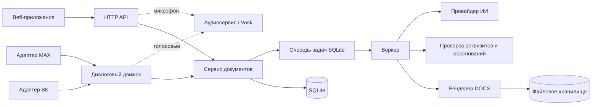

<div align="center">

🇷🇺 Русский | [English](README.en.md)

# 📄 DocxGen

**ИИ-генератор российских деловых документов**

Генерация документов ГОСТ в формате DOCX из текстовых черновиков с помощью ИИ-коррекции, извлечения полей и профессионального форматирования.

[](https://opensource.org/licenses/MIT)
[](https://nodejs.org/)
[](https://pnpm.io/)
[](https://www.typescriptlang.org/)
[](https://react.dev/)
[](https://expressjs.com/)
[](#-быстрый-старт)

</div>

---

## 🎯 Обзор

DocxGen — это ИИ-генератор российских деловых документов, предназначенный для организаций, которым необходимо быстро и точно создавать документы, соответствующие ГОСТ.

**Как это работает:**
1. Пользователь предоставляет текстовый черновик (через веб-интерфейс, бот MAX или бот VK)
2. ИИ исправляет орфографию, грамматику и стиль
3. Система извлекает необходимые реквизиты (отправитель, получатель, дата и т.д.)
4. DOCX-файл формируется в соответствии с ГОСТ
5. Пользователь скачивает готовый документ

**Основные возможности:**
- 🤖 ИИ-коррекция текста и извлечение полей
- 📋 9 типов документов × 2 шаблона = 18 профессиональных макетов
- 🎙️ Распознавание русской речи (Vosk)
- 💬 Мультиканальность: веб-интерфейс + бот MAX + бот VK
- ✅ Проверки соответствия ГОСТ Р 7.0.97-2016
- 📜 История версий с возможностью восстановления

---

## ✨ Возможности

| Возможность | Описание |
|-------------|----------|
| **ИИ-коррекция текста** | Автоматическое исправление орфографии, грамматики и стиля |
| **Извлечение полей** | ИИ извлекает отправителя, получателя, дату, тему из текста черновика |
| **Соответствие ГОСТ** | Автоматические проверки по российскому государственному стандарту Р 7.0.97-2016 |
| **Система плейсхолдеров** | Русские названия служат ключами полей — интуитивно понятно для пользователей |
| **Обоснование полей** | ИИ должен цитировать исходный текст для извлеченных полей — возможность аудита |
| **История версий** | Отслеживание всех версий документа с возможностью восстановления |
| **Пакетная обработка** | Обработка до 20 документов одновременно |
| **Распознавание речи** | Распознавание русской речи через Vosk — диктовка документа |
| **Мультиканальность** | Веб-интерфейс, бот MAX, бот VKontakte |
| **Кэширование файлов** | Дедупликация на основе хеша содержимого |
| **Автоматическая очистка** | Настраиваемое время хранения файлов и журналов |

---

## 🚀 Быстрый старт

```bash
# 1. Установить зависимости
pnpm install

# 2. Настроить окружение (интерактивный мастер)
pnpm setup:env

# 3. (Опционально) Настроить распознавание аудио/речи
pnpm setup:audio

# 4. Запустить сервер разработки
pnpm dev
```

**Доступ к приложению:**
- **Фронтенд:** http://localhost:5173 (сервер разработки Vite)
- **Backend API:** http://localhost:3000

Сервер разработки Vite автоматически проксирует запросы `/api` на backend.

---

## ⚙️ Скрипты настройки

### `pnpm setup:env` — Настройка окружения

Интерактивный мастер настройки `.env`. Запуск из корня проекта:

```bash
pnpm setup:env
```

Запускает интерактивный CLI, который проведёт вас через:

| Раздел | Что настраивается |
|--------|-------------------|
| **Сервер** | Порт, публичный URL, каталог данных, уровень журнала |
| **Провайдер ИИ** | OpenAI, OpenCode CLI или режим мока |
| **Настройки ИИ** | API-ключи, среда выполнения, выбор модели |
| **Боты** | Интеграции MAX и VK (опционально) |

**Возможности:**
- Создаёт файл `.env` в корне проекта
- Может быть перезапущен для обновления существующей конфигурации
- Валидирует ввод на каждом шаге
- Предоставляет разумные значения по умолчанию

### `pnpm setup:audio` — Сервис распознавания речи

Настраивает сервис распознавания аудио/речи на базе Vosk:

```bash
pnpm setup:audio
```

**Этот скрипт:**
1. Проверяет наличие `ffmpeg` в PATH (необходим для обработки аудио)
2. Создаёт виртуальное окружение Python в `packages/backend/.venv-audio`
3. Устанавливает Python-пакет `vosk`
4. Скачивает русскую модель Vosk (`vosk-model-small-ru-0.22`), если она отсутствует

**Предварительные требования:**
- Установленный Python 3.x
- Установленный `ffmpeg` в системе

**Что это даёт:**
- Транскрибация голосовых сообщений на русском языке
- Диктовка через микрофон в веб-интерфейсе
- Обработка аудио для каналов ботов

---

## 🏗️ Архитектура



**Поток данных:**
1. Пользователь отправляет текст через веб-интерфейс, MAX или VK
2. Сервис документов создаёт задачу в очереди SQLite
3. Воркер обрабатывает задачу: ИИ корректирует текст → извлекает поля → проверяет
4. Рендерер DOCX генерирует документ, соответствующий ГОСТ
5. Файл сохраняется и передаётся пользователю

---

## 📡 Справочник API

### Аутентификация
Идентификация на основе cookies — вход не требуется. Идентификация пользователя автоматическая.

### Эндпоинты

| Метод | Эндпоинт | Описание |
|--------|----------|----------|
| `GET` | `/health` | Проверка работоспособности |
| `GET` | `/api/catalog` | Доступные типы документов и шаблоны |
| `POST` | `/api/documents` | Создание нового документа |
| `POST` | `/api/documents/:id/process` | Запуск ИИ-обработки (асинхронно) |
| `PATCH` | `/api/documents/:id` | Обновление документа |
| `PUT` | `/api/documents/:id/fields` | Установка значений полей |
| `POST` | `/api/documents/:id/render` | Рендеринг в DOCX |
| `GET` | `/api/files/:fileId` | Скачивание DOCX-файла |
| `POST` | `/api/audio/transcribe` | Преобразование речи в текст (русский) |
| `GET` | `/api/documents/:id/versions` | История версий |
| `POST` | `/api/documents/:id/retry` | Повторная попытка после сбоя ИИ |

**Полная документация API:** [docs/api.md](docs/api.md)

---

## 📑 Типы документов

| Тип | Назначение |
|-----|------------|
| **Служебная записка** | Внутренняя записка между подразделениями |
| **Докладная записка** | Докладная записка руководству |
| **Информационная справка** | Фактическое резюме для проверок/архивов |
| **Письмо** | Официальное письмо организации |
| **Пояснительная записка** | Техническое пояснение или обоснование |
| **Приказ** | Распоряжение или директива руководителя |
| **Протокол** | Протокол собрания или запись решения |
| **Акт** | Акт выполнения работ или проверки |
| **Заявление** | Личное или организационное заявление |

### Шаблоны

| Шаблон | Стиль |
|--------|-------|
| **Классический** | Times New Roman 14pt, межстрочный интервал 1,5, традиционный корпоративный макет |
| **Современный** | Arial 12pt, межстрочный интервал 1,15, современный нормативный макет |

---

## 🤖 Провайдеры ИИ

| Провайдер | API-ключ | Описание |
|-----------|----------|----------|
| `opencode` | Не требуется | OpenCode CLI со свободными моделями |
| `openai` | Требуется | API, совместимый с OpenAI (любой провайдер) |
| `mock` | Не требуется | Без ИИ, детерминированный вывод (для тестирования) |

**Настройка:** задайте `AI_PROVIDER` в файле `.env` через `pnpm setup:env`.

---

## 📁 Структура проекта

```
DocxGen/
├── packages/
│   ├── backend/          # Express 5 API + сервис документов
│   │   ├── config/       # doc-types/*.json, templates/*.json
│   │   └── src/
│   │       ├── ai/       # ИИ-пайплайн (промпт, обработка, парсинг)
│   │       ├── audio/    # Клиент Vosk STT
│   │       ├── core/     # documentService (жизненный цикл, рендеринг)
│   │       ├── docx/     # Блоки OOXML, рендеринг, единицы
│   │       ├── jobs/     # Очередь, воркер
│   │       ├── http/     # Маршруты REST API
│   │       ├── bot/      # Конечный автомат диалога
│   │       └── adapters/ # Адаптеры платформ MAX, VK
│   └── frontend/         # React 19 + Vite + Tailwind
├── scripts/              # Мастера настройки (setup-env.js, setup-audio.mjs)
├── prompts/              # Системный промпт ИИ (system.md)
├── docs/                 # Архитектура, API, шаблоны, справочник полей
├── examples/             # Примеры документов
├── Containerfile         # Сборка Docker/Podman
└── package.json          # Корневая конфигурация рабочего пространства
```

### README подпроектов

| Подпроект | Описание |
|-----------|----------|
| [packages/frontend](packages/frontend/README.md) | Веб-версия и мини-приложение MAX (React + Vite) |
| [packages/backend](packages/backend/README.md) | Единый backend: API, очередь, ИИ, DOCX, боты |
| [adapters/max](packages/backend/src/adapters/max/README.md) | Адаптер чат-бота MAX (polling / webhook) |
| [adapters/vk](packages/backend/src/adapters/vk/README.md) | Адаптер бота ВКонтакте (Long Poll / Callback API) |
| [adapters/common](packages/backend/src/adapters/common/README.md) | Общие утилиты адаптеров |
| [bot](packages/backend/src/bot/README.md) | Диалоговый движок, общий для всех мессенджеров |
| [audio](packages/backend/src/audio/README.md) | Аудиосервис распознавания речи (Vosk + ffmpeg) |
| [opencode](packages/backend/opencode/README.md) | Агент и образ OpenCode для ИИ-обработки |

---

## 🛠️ Доступные скрипты

| Команда | Описание |
|---------|----------|
| `pnpm install` | Установка всех зависимостей |
| `pnpm setup:env` | Интерактивная настройка окружения |
| `pnpm setup:audio` | Настройка распознавания речи Vosk |
| `pnpm dev` | Запуск полного стека разработки |
| `pnpm start` | Запуск backend + аудио (без фронтенда) |
| `pnpm build` | Сборка всех пакетов |
| `pnpm test` | Запуск тестов (Vitest) |
| `pnpm typecheck` | Проверка типов всех пакетов |

---

## 💬 Настройка ботов

### Бот MAX (российский мессенджер)

- **Локальная разработка:** режим опроса (polling)
- **Продакшн:** режим вебхуков

### Бот VK (VKontakte)

- **Локальная разработка:** режим Long Poll
- **Продакшн:** режим Callback API

**Подробные инструкции по настройке:** [docs/bots-setup.md](docs/bots-setup.md)

---

## ⚠️ Ограничения

| Ограничение | Обходной путь |
|-------------|---------------|
| SQLite локален для `DATA_DIR` | Используйте постоянный том для развёртывания |
| Режимы опроса только для локальной разработки | Продакшн требует HTTPS + вебхук/коллбэк |
| Mock ИИ детерминирован | Используйте `opencode` или `openai` для реальных исправлений |
| Среда выполнения OpenCode требует CLI | Установите OpenCode CLI или используйте контейнерную сборку |
| Файлы удаляются после истечения срока хранения | Скачивайте файлы до очистки |

---

## 📚 Документация

| Документ | Описание |
|----------|----------|
| [Архитектура](docs/architecture.md) | Проектирование системы и потоки данных |
| [REST API](docs/api.md) | Полный справочник API |
| [Генерация документов](docs/document-generation.md) | Как создаются документы |
| [Шаблоны](docs/TEMPLATES.md) | Справочник системы шаблонов |
| [Справочник полей](docs/FIELDS-REFERENCE.md) | Все поля документов |
| [Протокол плейсхолдеров](docs/PLACEHOLDER-PROTOCOL.md) | Документация системы плейсхолдеров |
| [ИИ-обработка](docs/ai.md) | Подробности ИИ-пайплайна |
| [Аудио-сервис](docs/audio-service.md) | Интеграция Vosk STT |
| [Настройка ботов](docs/bots-setup.md) | Конфигурация ботов MAX и VK |
| [Руководство по интеграции](docs/integration-guide.md) | Как интегрироваться с DocxGen |
| [Добавление типов/шаблонов](docs/adding-type-or-template.md) | Расширение типов документов |
| [Текущие ограничения](docs/limitations.md) | Известные проблемы и ограничения |

---

## 🤝 Участие в проекте

Приглашаем к участию! Пожалуйста, следуйте этим шагам:

1. **Форкните** репозиторий
2. **Создайте** ветку функции (`git checkout -b feature/amazing-feature`)
3. **Коммитьте** свои изменения (`git commit -m 'Add amazing feature'`)
4. **Отправьте** в ветку (`git push origin feature/amazing-feature`)
5. **Откройте** Pull Request

### Рекомендации по разработке

- Используйте `pnpm` в качестве менеджера пакетов (никогда не npm/npx)
- Следуйте существующему стилю кода
- Добавляйте тесты для новых функций
- Обновляйте документацию по мере необходимости

---

## 📄 Лицензия

Этот проект лицензирован по **MIT License** — см. файл [LICENSE](LICENSE) для подробностей.

---

## 🙏 Благодарности

- [docx](https://github.com/dolanmiu/docx) — генерация документов OOXML
- [Vosk](https://alphacephei.com/vosk/) — распознавание русской речи
- [vk-io](https://github.com/node-libs/vk-io) — интеграция с ботами VKontakte и MAX
- [Radix UI](https://www.radix-ui.com/) — доступные React-компоненты
- [Framer Motion](https://www.framer.com/motion/) — библиотека анимаций

---

<div align="center">

**Создано с ❤️ для автоматизации российских деловых документов**

</div>
