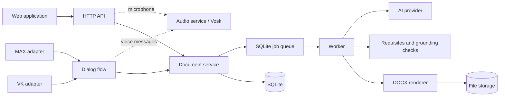

# Architecture

DocxGen runs as one backend process. The web API, MAX and VK are transport
adapters around the same document service, queue, worker, AI pipeline and
SQLite database. Speech recognition runs in a separate audio service (Vosk) used
by both the web microphone and bot voice messages.



## Composition root

`packages/backend/src/server.js` is the only production server entry point. It
creates `createRuntime()` from `runtime.js`, listens on `PORT`, and closes the
HTTP server, pollers, worker and database together.

`runtime.js` wires these layers:

- `core/documentService.js` owns document lifecycle, ownership checks and the
  public document view;
- `jobs/queue.js` and `jobs/worker.js` process AI and rendering jobs;
- `bot/flow.js` contains the platform-independent dialog state machine;
- `adapters/max` and `adapters/vk` translate platform events into the shared
  dispatcher and send replies back through their platform;
- `audio/audioClient.js` sends audio to the audio service (`audio-service.js`,
  see [audio-service.md](audio-service.md)); `audio/botAudio.js` downloads bot
  voice messages for it, and `POST /api/audio/transcribe` forwards web recordings;
- `http/api.js` exposes the web API and uses the same document service directly;
- `client/localDocumentServiceClient.js` is the owner-bound facade used by the
  dialog flow. `client/documentServiceClient.js` remains available for an
  external integration, but is not used by the in-process adapters.

There is deliberately no standalone MAX, VK or document-service backend
process. This keeps one queue and one worker responsible for a job and
prevents adapters from consuming each other's work.

## Ownership

Web requests are scoped to an `httpOnly` session cookie. Messenger events use an
owner `{ platform, id }` inside the flow. HTTP integrations may send
`X-Owner-Platform` and `X-Owner-Id`, but only with the configured `X-API-Key`.
Every document and file lookup checks the owner at the service boundary.

## Running

```bash
pnpm install
cp .env.example .env
pnpm dev
```

The backend listens on `PORT` (3000 by default); Vite serves the web UI on
5173 and proxies `/api` and `/health` to that port. Enable MAX or VK in the
same `.env`; no extra backend command is needed.

For production, run `pnpm start` behind an HTTPS reverse proxy when a platform
requires webhooks. Use `MAX_MODE=polling` and `VK_MODE=longpoll` for local
development, or the webhook/callback modes on a public HTTPS URL.

## Maintenance jobs

The cleanup handler runs at startup and then every `CLEANUP_INTERVAL_MS` while
`CLEANUP_ENABLED=1`. It removes unreferenced old files and old queue, inbound
event and processing-log rows. The interval is unref'ed, so it never prevents a
clean shutdown.
